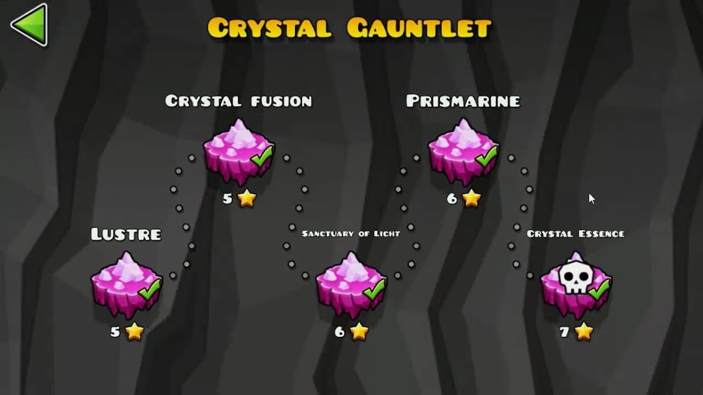

<h1 style="vertical-align:center">
  

     crystal-gauntlet
  

</h1>

a [Geometry Dash](https://store.steampowered.com/app/322170/Geometry_Dash/) server reimplementation in [Crystal](https://crystal-lang.org/), focusing on speed and 1:1 recreations of vanilla GD features

_this project is still in its very early stages. you can see a rough estimate of the current progress in [this issue](https://git.oat.zone/oat/crystal-gauntlet/issues/1)._

## why?

i was highly disappointed with the lack of options in private server choices - the two most well known ones that i noticed were [Cvolton's GDPS](https://github.com/Cvolton/GMDprivateServer) which has very little customization and some of the most atrocious code i've seen in a while (though i can't really blame it, being written in PHP), and [Realistik's buzzword-filled Python GDPS](https://github.com/RealistikDash/RealistikGDPS/) which i find hard to believe is seriously trying to sell itself with _docker and mongodb_.

i was also disappointed with the sheer simplicity of servers - most will get data and serve data and that's about it, but looking into how they're implemented made me realize many security pitfalls in Geometry Dash's server structure. for instance - even if you're storing the amount of objects a level has, you're _trusting the client that they've given you an accurate count_, and they could really have way more, making games unexpectedly severely lag or crash.

additionally, the lack of configuration compelled me even more to write my own solution, so one night of considering [XKCD 927](https://xkcd.com/927/) later, here we are

### features

- crystal gauntlet is cross-compatible with many SQL engines - while SQLite will recieve the most amount of support due to the sheer ease it gives when debugging, PostgreSQL, MySQL, etc. are also supported
- being written in Crystal, it's compiled, lightweight and extremely fast - a typical `getGJLevels` request will take about **~700µs**, authorization is highly cached and will typically have no impact on requests and extensive amounts of effort are done to ensure the [sql database structure](db/migrations/) is as efficient as it can get
- crystal gauntlet is [highly configurable](./config.example.toml) letting you enforce object limits, ban certain objects, disable certain song reuploading sources and much more
- it takes the time to [parse uploaded levels](src/lib/level.cr) to make sure nothing malicious gets through, and it gets away with it performance-wise, too
- it utilizes `yt-dlp` and `ffmpeg` to let you reupload songs from YouTube, SoundCloud, and [1700+ other sources](https://github.com/yt-dlp/yt-dlp/blob/master/supportedsites.md), all of which can be toggled on or off

## build

`shards install` && `shards build`

## setup

copy `.env.example` to `.env` and fill it out, same for `config.example.toml` -> `config.toml`

run `bin/crystal-gauntlet migrate` (or `shards run -- migrate`)

**schemas are highly unstable so you will be offered 0 support in migrating databases for now**, however in the future you'll want to run this each time you update

then `bin/crystal-gauntlet` (or `shards run`) to start the server

## attributions & credits

- [Jill "oatmealine" Monoids](https://git.oat.zone/oat) and [winter](https://git.oat.zone/wint0r): main developers
- a lot of the implementation specifics were taken from [Cvolton's private server](https://github.com/Cvolton/GMDprivateServer) and [matcool's pygdps](https://github.com/matcool/pygdps/); [TeamHax's GDDocs](https://github.com/TeamHaxGD/GDDocs/tree/master/endpoints) and [GD Programming Discord's GDDocs](https://docs.gdprogra.me/#/) were also frequently referenced

## real

real

