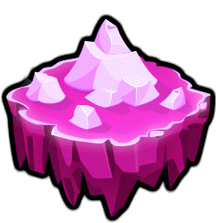

<h1 style="vertical-align:center">
  

     crystal-gauntlet
  

</h1>

a [Geometry Dash](https://store.steampowered.com/app/322170/Geometry_Dash/) server reimplementation in [Crystal](https://crystal-lang.org/), focusing on speed and 1:1 recreations of vanilla GD features

_this project is still in its very early stages. you can see a rough estimate of the current progress in [this issue](https://git.oat.zone/oat/crystal-gauntlet/issues/1)._

## build

`shards install` && `shards build`

you may need to head into `lib/` to fix deps. i'm Very sorry

## setup

copy `.env.example` to `.env` and fill it out, same for `config.example.toml` -> `config.toml`

run `bin/crystal-gauntlet migrate` (or `shards run -- migrate`)

**schemas are highly unstable so you will be offered 0 support in migrating databases for now**, however in the future you'll want to run this each time you update

then `bin/crystal-gauntlet` (or `shards run`) to start the server

## attributions & credits

- [Jill "oatmealine" Monoids](https://git.oat.zone/oat) and [winter](https://git.oat.zone/wint0r): main developers
- a lot of the implementation specifics were taken from [Cvolton's private server](https://github.com/Cvolton/GMDprivateServer) and [matcool's pygdps](https://github.com/matcool/pygdps/); [TeamHax's GDDocs](https://github.com/TeamHaxGD/GDDocs/tree/master/endpoints) and [GD Programming Discord's GDDocs](https://docs.gdprogra.me/#/) were also frequently referenced

## real

real

